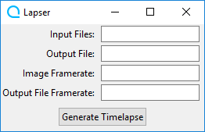

# Lapser



## Requirements

* Python 3.X - can be downloaded from <https://www.python.org>

* The `ffmpeg-python` module - can be installed with
```python3 -m pip install ffmpeg-python```

* FFmpeg - can be downloaded from <https://www.ffmpeg.org> Note: FFmpeg must be in the system path

## Usage

1. Set input files. Input files must be set as a full file path with a pattern selector. If you have 20 files named `IMG0000.JPG` through `IMG0019.JPG` in `C:\Users\username\Projects\Timelapse\InputImages`, you would set input files to `C:\Users\username\Projects\Timelapse\InputImages\IMG%04d.JPG`. Note: filename numbers must start at 0.

2. Set output file. Again, this must be a full path. You would set this to something like `C:\Users\username\Projects\Timelapse\output.mp4`.

3. Set timelapse framerate. This will be the rate at which the images are displayed in frames per second.

4. Set file framerate. This will be the framerate of the output file in frames per second. Common values include 30 and 60.

5. Generate timelapse. Once you have all the settings plugged in, just press the "Generate Timelapse" button. This could take a while depending on how many images you have and their size, so be patient! Don't worry if the program says it's not responding, this is normal behavior. A second window may appear with FFMPEG's output, just let it do its thing. If the specified output file already exists, this window will ask you whether or not to overwrite it.
